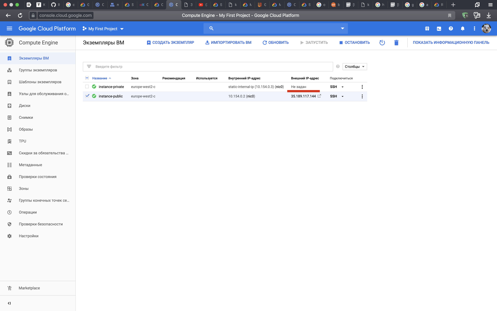

## Cats in the Clouds

В качестве облачного провайдеры был выбран Google Cloud Platform. Перед началом ознакомился со всеми предоставляемыми услугами [в этом плейлисте](https://www.youtube.com/playlist?list=PLIivdWyY5sqJ0oXcnZYqOnuNRsLF9H48u)

Для начала настроим сеть. Выберем режим "автоматический", тогда нам самим не придется создавать подсети. 


Видим, что создалось 20 подсетей автоматически. 

Теперь перейдем к созданию инстансов. Для начала создадим публичный инстанс. Во время создания укажем этому инстансу нашу приватную сеть. Сами инстансы будем создавать в зоне **europe-west2-c**. После это зарезервируем для этого инстанса статический публичный ip. 


Теперь нужно установить web-сервер на этот интанс и сделать на нем веб-страничку. Я использовал веб-сервер Apache2. 

```
sudo apt-get update && sudo apt-get install apache2 -y
```
Инстанс создается совсем пустым, поэтому доустановим vim. ``` sudo apt-get install vim ```

И в файле **/var/www/html/index.html** создадим страничку, которая будет видна извне.

``` html
<!doctype html>
<html>
	<body>
		<h1>SBT Networks 2019 External</h1>
		
	</body>
</html>
```
Отлично, теперь наш сайт доступен по ip. [Вот ссылка](http://35.189.117.144/)
Теперь нужно зарегистрировать доменное имя. Я использовал reg.ru 
Вот так выглядит личный кабинет на этом сайте:


Теперь публичный сайт доступен через доменное имя. [Вот ссылка](http://kakzakritseti.site/)

---

Создадим такую же машину, проделаем такие же операции и получим машину в приватной сети (разумеется, публичного ip у нее нет). 

Так должны выглядеть два инстанса:



Для удобства эксплуатации добавим локальный ssh-ключ на публичный инстанс. Можно еще прокинуть ключ с публичного на приватный инстанс, но я этого делать не буду. 

 

Если в данный момент зайти на приватный хост из web-терминала, то на нем не будет доступа в интернет. Нужно настроить NAT. Во время создания NAT еще пришлось создать роутер. 


Теперь если зайти на приватный инстанс, там будет доступ в интернет. 


Осталось добавить внутренний домен для доступа к сайту на приватном хосте. Для этого выделим статический внутренний ip для приватного хоста и доставим DNS в нашу приватную сеть. 


При добавлении новых инстансов в нашу сеть, Google сам может назначать им ip адреса, поэтому DHCP нам не нужен. 

Теперь проверим, что все работает. С локальной машины доступен внешний хост по доменному имени, внутрений - нет. 

``` bash
~                                                                       35m 38s
❯ curl kakzakritseti.site
<!doctype html>
<html>
	<body>
		<h1>SBT Networks 2019 External</h1>
		
	</body>
</html>

~
❯ curl cat.myzone.example.com
curl: (6) Could not resolve host: cat.myzone.example.com

~
❯
```
Теперь зайдем на внешний хост по ssh. Теперь доступны все сайты. 

``` bash
❯ ssh kakzakritseti.site
Welcome to Ubuntu 18.04.3 LTS (GNU/Linux 5.0.0-1026-gcp x86_64)

 * Documentation:  https://help.ubuntu.com
 * Management:     https://landscape.canonical.com
 * Support:        https://ubuntu.com/advantage

This system has been minimized by removing packages and content that are
not required on a system that users do not log into.

To restore this content, you can run the 'unminimize' command.

7 packages can be updated.
0 updates are security updates.

Last login: Sun Dec 15 14:49:24 2019 from 93.175.28.5
nikitamikhaylov@instance-public:~$ curl localhost
<!doctype html>
<html>
	<body>
		<h1>SBT Networks 2019 External</h1>
		
	</body>
</html>
nikitamikhaylov@instance-public:~$ curl cat.myzone.example.com
<!doctype html>
<html>
	<body>
		<h1>SBT Networks 2019 Internal</h1>
		
	</body>
</html>
```